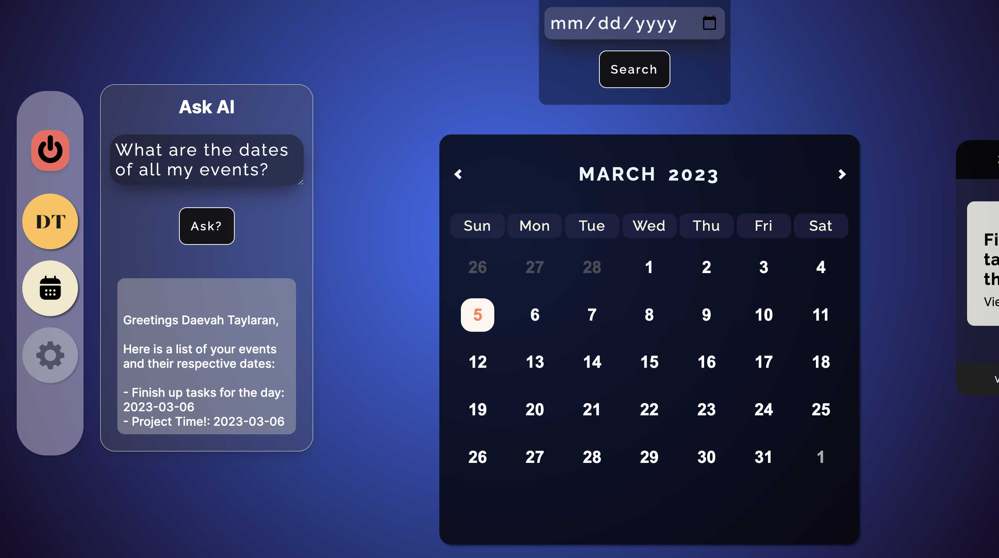
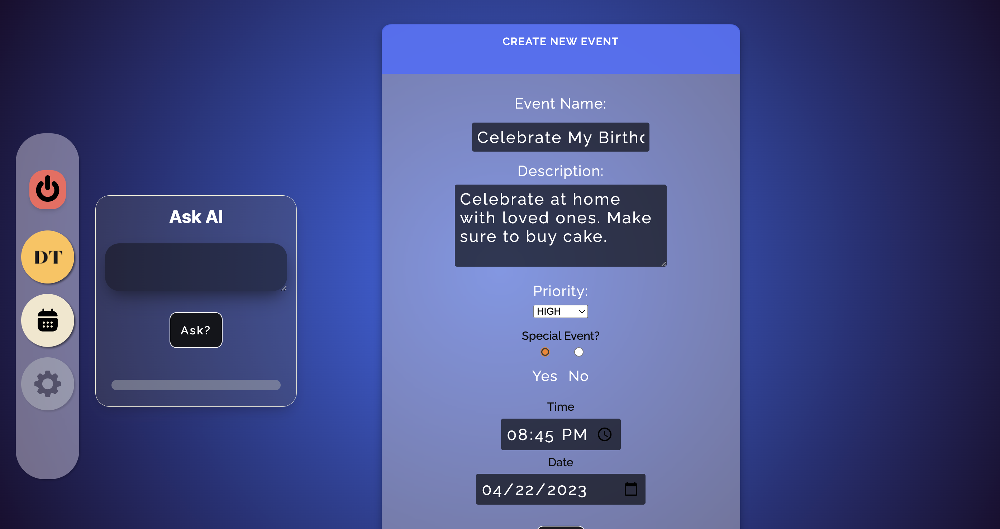

## Planit
___
A simple task management application, where users are able to manage events/tasks by utilizing a calendar view, as well as input dates, and access their data using an AI assistant. In addition to being able to manually create, read, update, and delete personal events, the AI assistant is able to suggest events, locations, and retrieve the user's data according to user's commands.

### Screenshot
___

### Technologies Used
___
- JavaScript
- HTML
- CSS
- NodeJS
- Express
- MongoDB, Mongoose
- <a href="https://vanilla-calendar.frontend.uvarov.tech/api/">Vanilla Calendar API</a>
- <a href="https://platform.openai.com/docs/api-reference/introduction">OpenAI API</a>

### Getting Started
___

<a href="https://trello.com/b/8n4we4d9/full-stack-app">Project Planning</a>
<a href="https://planitask.herokuapp.com/dashboard">Deployed App</a>

### Next Steps
___